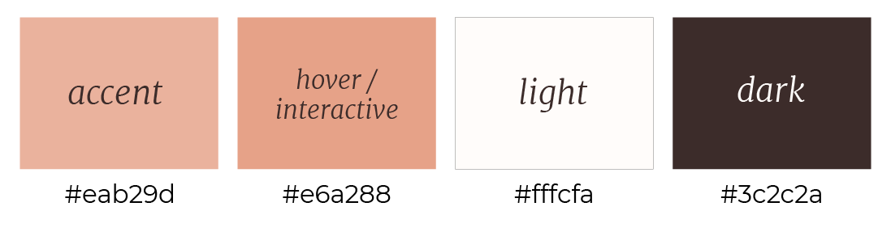
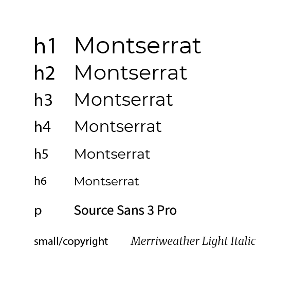

<h1 align="center">Nina Gazzard SPMU & Beauty</h1>

[View the live project here.](https://sdthomas91.github.io/ng-spmu-milestone/)

This is the main marketing site for Nina Gazzard Semi-Permanent Makeup and Beauty. It is designed to be responsive and accessible on a range of devices, making it easy and accessible for clients and collaborators alike. It is a continuous scroll, single page site with a modal pop-up newsletter sign-up. It will also feature a modal gallery for mobile users.

Utilising Bootstrap row/column tool the site will present responsively and in a well structured, readable, easy to navigate way so as to allow maximum UX.

<h2 align="center"></h2>

## User Experience (UX)

- ### User stories

  - #### First Time Visitor Goals

    1. As a First Time Visitor, I want to easily understand the main purpose of the site and learn more about the practitioner/organisation.
    2. As a First Time Visitor, I want to be able to easily locate an option to contact or book in.
    3. As a First Time Visitor, I want to be able to easily navigate throughout the site to understand pricing and details of different services
    4. As a First Time Visitor, I want to look for testimonials to understand what their users think of them and see if they are trusted. I also want to locate their social media links to see their followings on social media to determine how trusted and known they are.

  - #### Returning Visitor Goals

    1. As a Returning Visitor, I want to find new or existing services.
    2. As a Returning Visitor, I want to find the best way to get in contact with the organisation with any questions I may have.
    3. As a Returning Visitor, I want to find Community/Social links.

  - #### Frequent User Goals
    1. As a Frequent User, I want to be able to easily book my favourite services.
    2. As a Frequent User, I want to check to see if there are any new results images to see work/improvements.
    3. As a Frequent User, I want to have easy contact options to discuss my bookings.

- ### Design

  - #### Colour Scheme

    - The three main colours used are #eab29d (Accent), #e6a288 (Interaction Feedback on Accent Colour), #3c2c2a (Dark) and off-white #fffcfa (Light) .

    

  - #### Typography

    - The Montserrat font is the main font used throughout the whole website with Sans Serif as the fallback font in case for any reason the font isn't being imported into the site correctly. Montserrat is a clean font used frequently in programming, so it is both attractive and appropriate.
    - Additional typography will include Source Sans Pro as a nice pairing for Montserrat recommended [here](https://www.figma.com/google-fonts/montserrat-font-pairings/). It is a modern sans-serif font that provides a minimalist and readable text.
    - An additiona font of Merriweather from Google fonts will be used for small and copyright text - a clean modern serif font maintaining class and readability.

    

  - #### Imagery

    - Imagery is important. The large, background hero image is designed to be striking and catch the user's attention. It also has a modern, energetic aesthetic.
    - The image of the technician provides a face, building trust between the user and the site owner
    - Stock images are used for the services provided to ensure high quality, professional appearance. Again reinforcing trust between user and owner.

  - #### Interaction Feedback
    - Accent colours are used upon interaction such as hover and click to provide feedback to the user that they are interacting with an element, and that the element serves a purpose. Examples include button hover changing from the primary #eab29d to a deeper #e6a288 and the nav items changing from a light grey to a dark grey.

## Wireframes

- Main Page Wireframe - [View](https://www.figma.com/file/0p1Nlz6Kia954xdU5fe7HX/NG-spmu-wireframe?type=design&node-id=0%3A1&t=dXZ1j4cKAh2razPm-1)

- Newsletter Modal Wireframe - [View](https://www.figma.com/file/6WPw1s4hxmiNXuZN8FP4b0/Untitled?type=design&node-id=0%3A1&t=irnY2dMoasWcrNAW-1)

  ### Deviations

  It should be noted that whilst the wireframes were implemented as part of the skeleton phase of UX planning at the outset, applying that 5 S's throughout led to some important amendments to increase functionality. I also realised that having originally planned for a newsletter modal, this did not fit in with the scope of the project. Instead, I have amended to use a book now modal, following feedback from a number of users. This provides an immediate and accessible option to submit a booking enquiry (in the place of a booking system, as that, too fell outside of the scope of this project)

## Features

- Responsive on all device sizes

- Interactive elements

- Modal features for seamless single page functionality

- Section ID's allow for anchor links in Nav to provide a seamless navigation

- Fixed navigation to allow easy navigation of single scroll page

- Back to top button allows quick navigation of single scroll page

- Interaction feedback used throughout - this includes all clickable buttons/links, back to top button, navigational elements and social media icons. It included font size increasing, font colour changing, background and foreground colours changing or a combination of the three.

  ### User Feedback Implementations

  - A number of users fedback that they would prefer to have an immediate option to submit a booking enquiry rather than scroll to a generic contact form (the navigation could take them there, but "it still felt too generic") As such, I implemented a second modal with the purpose of submitting a booking request. It includes prompts, user feedback and notification that it could take up to 48 hours for a response so as to set user expectations.

## Technologies Used

### Languages Used

- [HTML5](https://en.wikipedia.org/wiki/HTML5)
- [CSS3](https://en.wikipedia.org/wiki/Cascading_Style_Sheets)

### Frameworks, Libraries & Programs Used

1. [Bootstrap 4.4.1:](https://getbootstrap.com/docs/4.4/getting-started/introduction/)
   - Bootstrap was used to assist with the responsiveness and styling of the website.
1. [Hover.css:](https://ianlunn.github.io/Hover/)
   - Hover.css was used on the Social Media icons in the footer to add the float transition while being hovered over.
1. [Google Fonts:](https://fonts.google.com/)
   - Google fonts were used to import the 'Source Sans Pro' and 'Merriweather' fonts into the style.css file which is used on all pages throughout the project.
1. [Font Awesome:](https://fontawesome.com/)
   - Font Awesome was used throughout the website to add icons for aesthetic and UX purposes.
1. [jQuery:](https://jquery.com/)
   - jQuery came with Bootstrap to make the navbar responsive but was also used for the smooth scroll function in JavaScript.
1. [Git](https://git-scm.com/)
   - Git was used for version control by utilizing the Gitpod terminal to commit to Git and Push to GitHub.
1. [GitHub:](https://github.com/)
   - GitHub is used to store the projects code after being pushed from Git.
1. [Photoshop:](https://www.adobe.com/ie/products/photoshop.html)
   - Photoshop was used to resize images and editing photos for the website.
1. [Illustrator:](https://www.adobe.com/uk/products/illustrator.html)
   - Illustrator was used to create the logo and website banners.
1. [Figma:](https://www.figma.com/)
   - Figma was used to create the wireframes during the design process.
1. [CSSGradient] (https://cssgradient.io/)
   - CSSGradient.io was used to generate css gradient backgrounds.
1. [OnePageLove] (https://onepagelove.com/)
   - OnePageLove was used as inspiration for continuous scroll websites
1. [StackOverflow] (https://stackoverflow.com/)
   - Used for code snippets and code validation
1. [GoogleBard] (bard.google.com)
   - Used Bard AI to help generate some good copy for the website

## Testing

A separate Markdown document has been added to showcase code/UI/UX testing throughout and can be found [here] (https://github.com/sdthomas91/ng-spmu-milestone/blob/main/TESTING.md)

The W3C Markup Validator and W3C CSS Validator Services were used to validate every page of the project to ensure there were no syntax errors in the project.

- [W3C Markup Validator](https://validator.w3.org/nu/#textarea) - Results can be seen in TESTING.md including errors and final validation
- [W3C CSS Validator](https://jigsaw.w3.org/css-validator/#validate_by_input) - - Results can be seen in TESTING.md including errors and final validation

### Testing User Stories from User Experience (UX) Section

- #### First Time Visitor Goals

  1. As a First Time Visitor, I want to easily understand the main purpose of the site and learn more about the practitioner/organisation.

     1. Upon entering the site, users are automatically greeted with a clean and easily readable navigation bar to go to the section of their choice. Underneath there is a Hero Image with encouraging text and a "Book Now" Call to action button.
     2. The title gives a clear idea of the service being provided and prompts to book in.
     3. The user has two options, click the call to action buttons or scroll down. The former will allow them to book/enquire about the services available, the latter will allow them to learn more about the organisation.
     4. The back to top button gives the indication that there is more site to scroll, encouraging the exploration of the site.

  2. As a First Time Visitor, I want to be able to easily locate an option to contact or book in.

     1. There are two immediate options when first loading the page to book in for the services mentioned, wherein you can select the services you are interested in. This enables a modal so there is no need to leave the page in order to complete the booking process,.
     1. The site has been designed to be fluid and never to entrap the user. The site provides a fixed nav bar and plenty of navigational links throughout the flow of the continous scroll page.
     1. On the Contact Us Page, after a form response is submitted, the page refreshes and the user is brought to the top of the page where the navigation bar is.

  3. As a First Time Visitor, I want to be able to easily navigate throughout the site to understand pricing and details of different services

     1. The user has immediate navigational ability to reach the pricing and services section via the nav bar
     2. With the flow of the site, once the user has read the services section they are able to navigate by either scrolling to the next section for pricing or clicking on the "See Pricing" links to go directly to the relevant pricing.

  4. As a First Time Visitor, I want to look for testimonials to understand what their users think of them and see if they are trusted. I also want to locate their social media links to see their following on social media to determine how trusted and known they are.
     1. Once the new visitor has read the About Us and What We Do text, they will notice the Why We are Loved So Much section.
     2. The user can also scroll to the bottom of any page on the site to locate social media links in the footer.
     3. At the bottom of the Contact Us page, the user is told underneath the form, that alternatively they can contact the organisation on social media which highlights the links to them.

- #### Returning Visitor Goals

  1. As a Returning Visitor, I want to find new or existing services.

     1. All services are listed in the Book Now Modal so returning users can enquire directly about any new or existing services
     2. The sites navigation allows smooth access to services section with full details of the service and a link to the pricing for that service

  2. As a Returning Visitor, I want to find the best way to get in contact with the organisation with any questions I may have.

     1. The navigation bar clearly highlights the "Contact" Section with additional ability to directly WhatsApp.
     2. Here they can fill out the form on the page, there are also options including email, WhatsApp and Facebook.
     3. The footer contains links to the organisations Facebook, Twitter and Instagram page as well as another link to the contact section.
     4. Whichever link they click, it will be open up in a new tab to ensure the user can easily get back to the website.
     5. The email button is set up to automatically open up your email app and autofill there email address in the "To" section.
     6. The WhatsApp link will work to open a conversation directly in WhatsApp with the relevant number.

  3. As a Returning Visitor, I want to find Community/Social links.
     1. The Facebook Page can be found in the Contact Section and will open in a separate tab so as to allow easy navigation back to the main site.
     2. Alternatively, the user can scroll to the bottom of the page where the footer is home to all relevant social links.

- #### Frequent User Goals

  1. As a Frequent User, I want to be able to easily book my favourite services.

     1. The user would already be familiar with the Booking process but will always have easy access to the Book Now options in the callout or in the navbar that allows them to quickly submit a booking request for their chosen service.

  2. As a Frequent User, I want to check to see if there are any new results images to see work/improvements.

     1. The user would already be comfortable with the website layout and can easily click the gallery link to view up to date before and after images

  3. As a Frequent User, I want to have easy contact options to discuss my bookings.
     1. The user would be familiar with the site layout and can use the nav menu to easily locate the contact option
     2. Alternatively, in the navbar also, the user may open a WhatsApp conversation directly
     3. The user may wish to use the dedicated contact form or indeed any of the other contact options provided there including email, WhatsApp or Facebook (Messenger)

### Further Testing

- The Website was tested on Google Chrome, Microsoft Edge and Safari browsers. It was also tested in Internet Explorer Mode on Microsoft Edge.
- The website was viewed on a variety of devices such as HP Windows Desktop, Macbook, iMac, iPhone12, iPhone 14 Pro, iPhone 8, iPad Air, iPad Pro 12.9", Pixel 5, Samsung Galaxy S20 Ultra, Surface Pro 7 and Nest Hub.
- A large amount of testing was done to ensure that all sections on the continuous scroll were linking correctly.
- Friends and family members were asked to review the site and documentation to point out any bugs and/or user experience issues.

#### Google Lighthouse

- Google Lighthouse was used to ensure compatability, best practice and accessibility as well as load times.

| Lighthouse mobile                                                     |                           Lighthouse Desktop                            |
| --------------------------------------------------------------------- | :---------------------------------------------------------------------: |
|  |  |

##### Load Speed

- Original load speed was in the 53 out of 100 on mobile and 79 out of 100 on desktop.
- Amended to be JPG instead of PNG as fallback - this increased performance to 92 out of 100 for dekstop and 80 out of 100 for mobile.

##### Accessibility

- Accessibility sits at 99 out of 100 - all vitals pass the only issue they have is that an H4 is used out of order. This is not something I feel affects the site in such a way that it needs amending.
- Aria used correctly and passes on all checks

##### Best Practices

- Best Practices sits at 92 out of 100 - this was vital as it threw up an issue I had overlooked - it failed to load the previously addd PNG files. This was because the images had not been amended on the Carousel and so still affected speed and best practices.
- Amended issue identified - logged details in TESTING.md and all working well.

### Known Bugs

- A comprehensive list of bugs and resolutions can be found in the TESTING.md file

## Deployment

### GitHub Pages

The project was deployed to GitHub Pages using the following steps...

1. Log in to GitHub and locate the [GitHub Repository](https://github.com/sdthomas91/ng-spmu-milestone)
2. At the top of the Repository (not top of page), locate the "Settings" Button on the menu.
   - Alternatively Click [Here](https://raw.githubusercontent.com/) for a GIF demonstrating the process starting from Step 2.
3. Scroll down the Settings page until you locate the "GitHub Pages" Section.
4. Under "Source", click the dropdown called "None" and select "Master Branch".
5. The page will automatically refresh.
6. Scroll back down through the page to locate the now published site [link](https://github.com/sdthomas91/ng-spmu-milestone) in the "GitHub Pages" section.

### Forking the GitHub Repository

By forking the GitHub Repository we make a copy of the original repository on our GitHub account to view and/or make changes without affecting the original repository by using the following steps...

1. Log in to GitHub and locate the [GitHub Repository](https://github.com/sdthomas91/ng-spmu-milestone)
2. At the top of the Repository (not top of page) just above the "Settings" Button on the menu, locate the "Fork" Button.
3. You should now have a copy of the original repository in your GitHub account.

### Making a Local Clone

1. Log in to GitHub and locate the [GitHub Repository](https://github.com/sdthomas91/ng-spmu-milestone)
2. Under the repository name, click "Clone or download".
3. To clone the repository using HTTPS, under "Clone with HTTPS", copy the link.
4. Open Git Bash
5. Change the current working directory to the location where you want the cloned directory to be made.
6. Type `git clone`, and then paste the URL you copied in Step 3.

```
$ git clone https://github.com/sdthomas91/ng-spmu-milestone
```

7. Press Enter. Your local clone will be created.

```
$ git clone https://github.com/sdthomas91/ng-spmu-milestone
> Cloning into `CI-Clone`...
> remote: Counting objects: 10, done.
> remote: Compressing objects: 100% (8/8), done.
> remove: Total 10 (delta 1), reused 10 (delta 1)
> Unpacking objects: 100% (10/10), done.
```

Click [Here](https://help.github.com/en/github/creating-cloning-and-archiving-repositories/cloning-a-repository#cloning-a-repository-to-github-desktop) to retrieve pictures for some of the buttons and more detailed explanations of the above process.

## Credits

### Code

- [Bootstrap4](https://getbootstrap.com/docs/4.4/getting-started/introduction/): Bootstrap Library used throughout the project mainly to make site responsive using the Bootstrap Grid System.

- [W3CSchools](https://www.w3schools.com/) W3C schools used to reinforce CSS understanding

- [MDN Web Docs](https://developer.mozilla.org/) : For Pattern Validation code. Code was modified to better fit my needs and to match an Irish phone number layout to ensure correct validation. Tutorial Found [Here](https://developer.mozilla.org/en-US/docs/Web/HTML/Element/input/tel#Pattern_validation)

- [StackOverflow](https://stackoverflow.com/) : For coding validation and tips on refining code. Also used for code snippets customised with my own css.

- [BootStrap Pricing](https://getbootstrap.com/docs/4.0/examples/pricing/#) : Used bootstrap template for pricing structure as it provides a nice clean setup - will completely restyle but saved a lot of time on setting up the blocks

- [Sitepoint](https://www.sitepoint.com/community/t/center-text-and-container-inside-a-circle/102963/2) : thread found on sitepoint helped to refresh how to center vertically and horizontally

### Content

- Google Bard AI was used to generate around 50% of the website copy

- Psychological properties of colours text in the README.md was found [here](http://www.colour-affects.co.uk/psychological-properties-of-colours)

- Colour combinations, hex code -> rgb conversion and palettes were found [here] (https://www.colorhexa.com/)

### Media

- Some Images were created or photographed by the developer - these include the Logo and the hero image.

#### Technician Image

- Technician image on home page - <a href="https://www.freepik.com/free-photo/woman-visiting-cosmetologist-making-rejuvenation-procedures_12178265.htm#query=beautician%20in%20salon&position=3&from_view=search&track=ais">Image by senivpetro</a> on Freepik

#### Services images

- Lip blush image - [Lip blush image used](https://www.canva.com/) Canva Pro - contributor @as-images237234231
- Eyeliner image - [Eyeliner image used](https://www.canva.com/) Canva pro - Getty Images - Contributor Luda311
- Microblading image - [Microblading image used](https://www.canva.com/) Canva pro - Getty Images Pro - Contributor MilanMarkovic

#### Results images for gallery

- Lips-1 : [Lip Image Result Lips1](https://www.canva.com) - Canva Pro - contributor @africa-images
- Lips-2 : [Lip Result Lips2](https://www.canva.com) - Canva pro - Getty Images - Contributor puhhha
- Brows-1 : [Brow Result Brows1](https://www.canva.com) - Canva pro - Getty Images - Contributor puhhha
- Brows-2 : [Brow Result Brows2](https://www.canva.com) - Canva pro - Getty Images - Contributor puhhha
- Brows-3 : [Brow Result Brows3](https://www.canva.com) - Canva pro - Getty Images - Contributor CherriesJD
- Brows-5 : [Brow Result Brows5](https://www.canva.com) - Canva pro - Getty Images - Contributor HDesert

#### README Mockup

- .ai file used for Mockup at the top of README file : Image by [Freepik](https://www.freepik.com/free-vector/flat-design-responsive-website-design_28747716.htm#query=multi%20device%20mockup&position=2&from_view=keyword&track=ais)

### Acknowledgements

- Tutor support at Code Institute for their support.

- Pasquale Fasulo for continuous helpful input and feedback

- ByteGrad Tips on YouTube for helpful tips on utilising bootstrap additional capabilities

- Friends and family for valuable insights and feedback
