<h1 align="center">Nina Gazzard SPMU & Beauty</h1>

[View the live project here.](https://sdthomas91.github.io/ng-spmu-milestone/)

The purpose of this document is to identify key testing stages and instances where decisions were made to change or keep certain features.

## Bugs

1. White Space down right hand side of screen - only on smaller screens

   - Systematically commented out each section and continued to refresh page. No section seemed responsible. Then commented out footer and white line disappeared. Added class of container-fluid and no-gutters to footer element and un-commented code and now working fine.

1. All fonts shrunk down to a tiny sizing and has thrown off entire web fonts

   - Tried hard refresh of browser window but did not work - closed down codeanywhere and reopened project with full reset and site now responding fine with correct size fonts.

1. ID anchor link stopped working

   - Anchor link for About Us section ceased functioning properly - had added Bootstrap class name "container-fluid" into the "id" instead of the "class". Removed and now works fine.

1. A new white space down the right hand side of the screen

   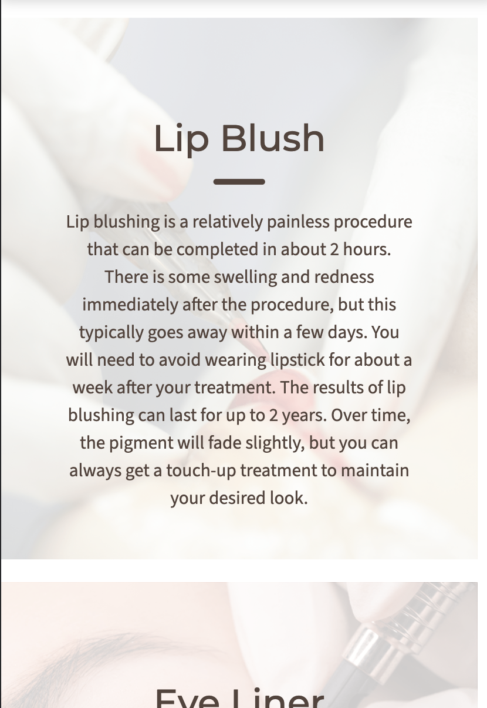

   - Used google chrome developer tools to examine each element. It became clear that the first and second div of the "Services Section" were responsible.
   - Attempted to utilise no gutters rule as this fixed the issue last time, but this time it was unsuccessful.
   - Within google chrome developer tools I noticed that the bootstrap "row" class was administering a margin right and left of -15px.
     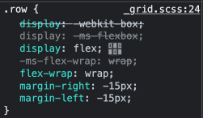
   - Once removed, white space disappeared. So added rule of margin:0 to "services-container" class and issue was resolved
     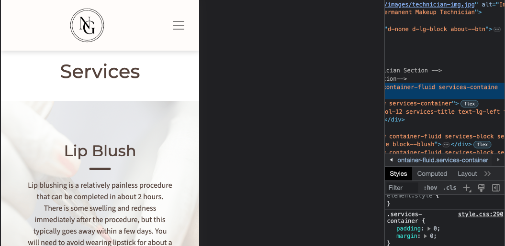

1. Whole first section has gone blank

   - On large screen the whole first section is blank/white, yet when scaled down the section returns to normal.

   | Desktop view (larger than 992px)                            |              Smaller (less than 992px) view              |
   | ----------------------------------------------------------- | :------------------------------------------------------: |
   | 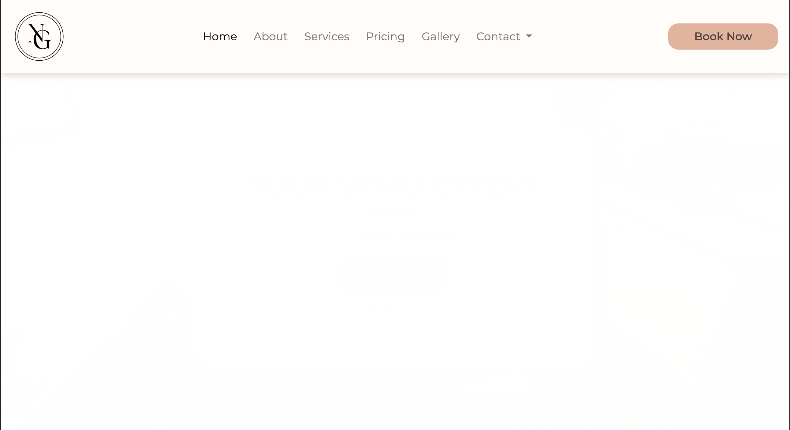 | 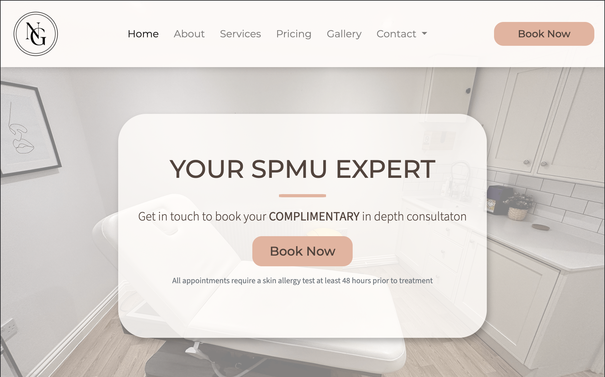 |

   - Issue seems to be with overlays for blocks in services section. They had all stacked at 100%.

   - Set overlay--light on blocks to only show on md screens and below and issue resolved itself

   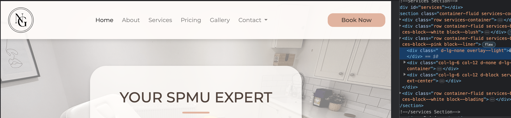

1. Images not showing on deployment

   - when website is deployed to github pages some images appear and others do not.
   - Launched from codeanywhere and website shows up all images okay.

   | Logo and hero not showing                 |                 Tech image present                 |                Services images present on large screen                 |                     no service images on small screen |
   | ----------------------------------------- | :------------------------------------------------: | :--------------------------------------------------------------------: | ----------------------------------------------------: |
   | 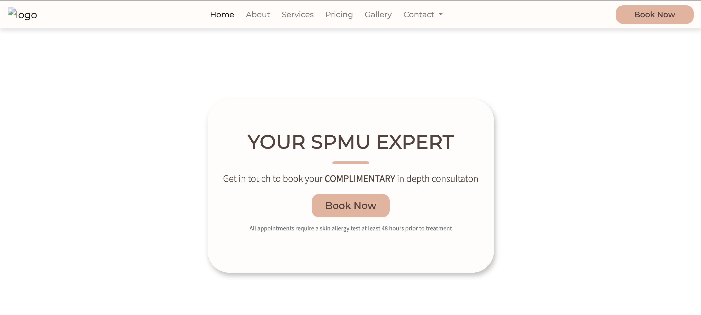 |  | 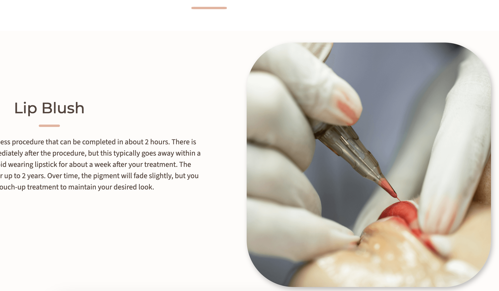 | 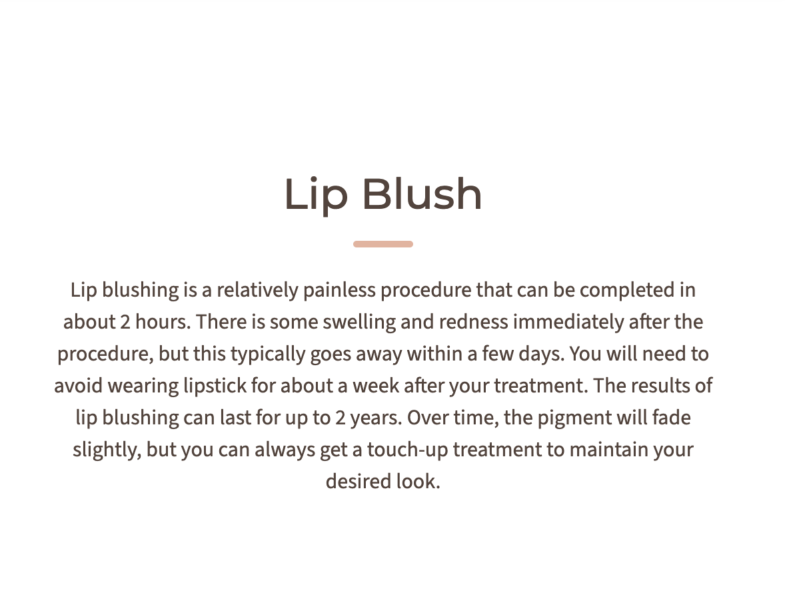 |

   - Chrome dev tools used to identify any links between images that do show and images that do not
   - Connection found - images showing source url started with "assets/" images not showing started with "/assets/"
   - corrected syntax and images now showing okay

1. Mobile view issue found - technician section sitting over to the right

   - Full screen the balance is fine but on mobile view the content is off center
   - 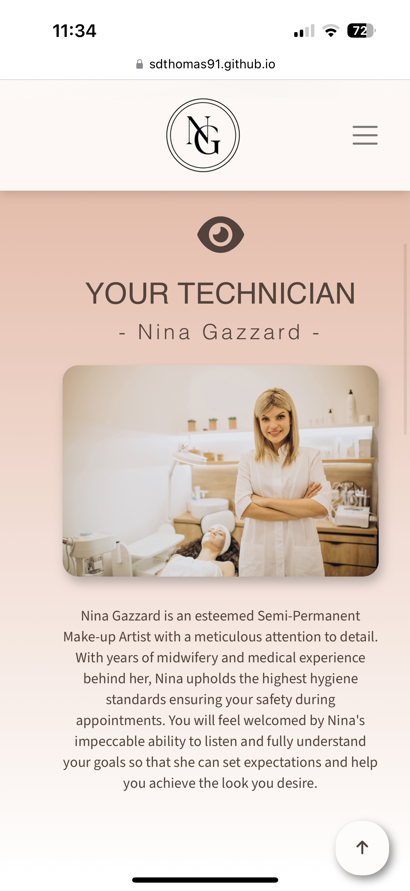
   - used dev tools to check and the margin used to create balance in full screen is what throws it off
   - Added media query to remove margin on smaller screens
   - Issue resolved and content now centered nicely
   - 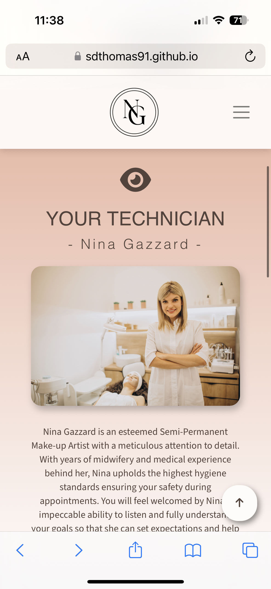

1. Nav link broken

   - Services link stopped working and lead to a 404 error
   - checked in dev tools and noticed file path had lost an "i" so it was reading ndex.html#services.
   - correct filepath spelling and link no longer led to a 404 but instead was reloading to top of the page
   - double checked again and I had used "##" instead of single hash for identified
   - Corrected syntax and now works fine

1. Pricing Cards not properly responsive

   - On desktop view cards look great, side by side. Mobile view the cards look great stacked. The in between would be okay, but the sizing is thrown off and the CTA buttons all misalign and spill off the card.

   | Desktop view (larger than 992px)                      |                Tablet view (less than 992px)                 |
   | ----------------------------------------------------- | :----------------------------------------------------------: |
   | 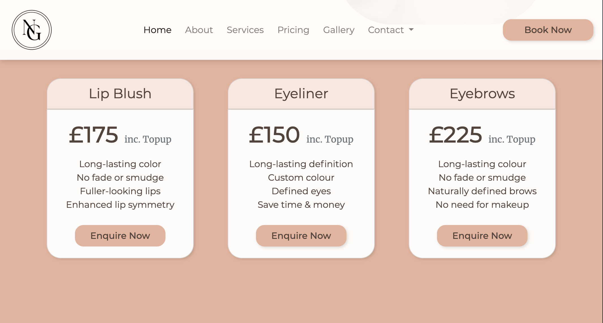 | 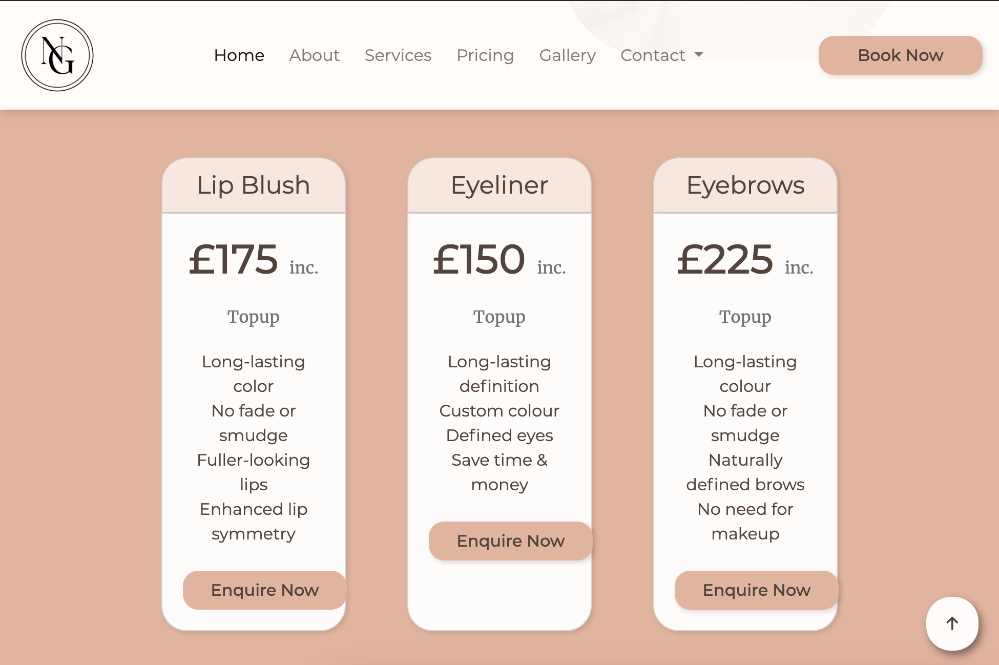 |

   - Dev tools used to identify margins being implemented until min-width if 576px. This won't work for smaller tablets.
   - Removed margins using an overriding media query for max screen width of 992px.
   - Issue resolved and now displays nicely across different screen sizes.

   Resolved 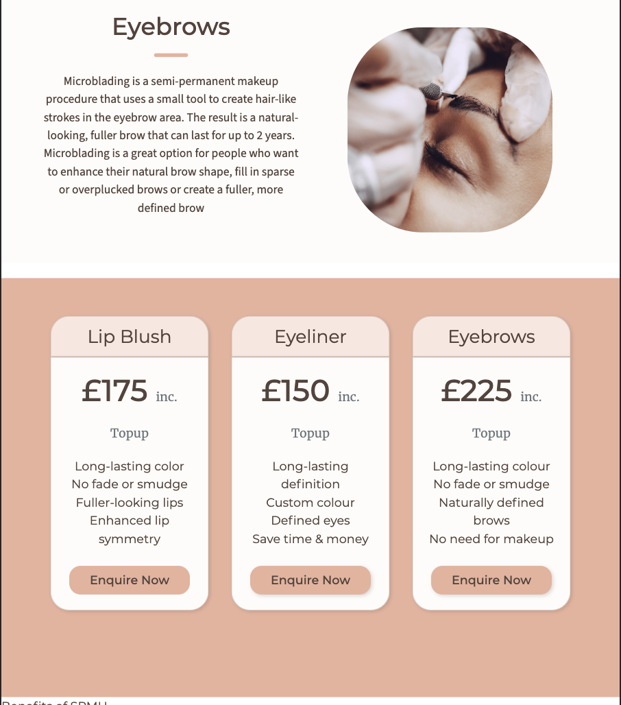

# SECTION TESTING

## Header

- ### Logo

  - When resolving an issue with the hero image I also noticed the logo sits off center on mobile view.

  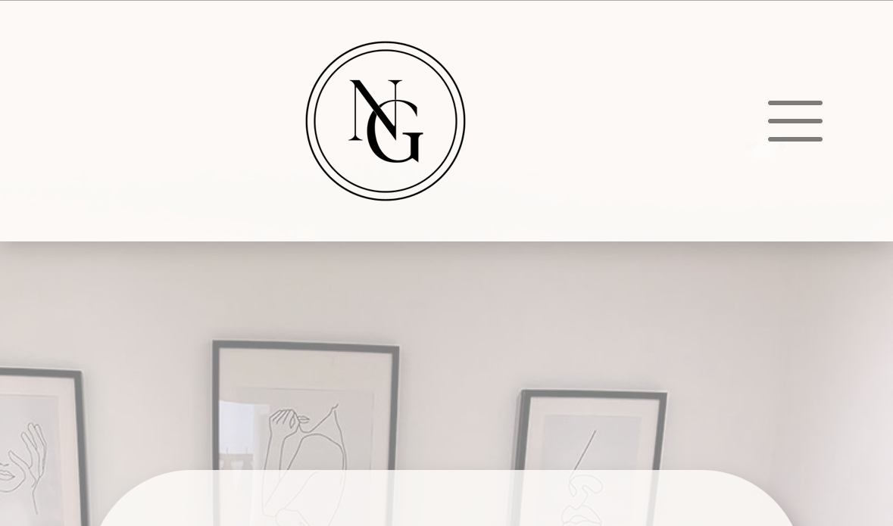

  - Using chrome dev tools I identified that the logo was centering in its own element (link) but that element wouldn't center.

  - added a left padding to mobile view only of 50px and issue resolved nicely

  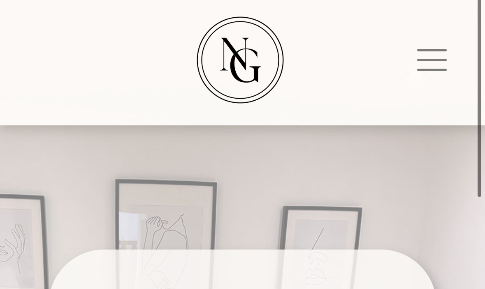

- ### Navigation

  - Standard navigation featured left aligned menu; amended this to ensure centre alignemnt for easy viewing.
  - Utilised bootstrap and css to ensure logo centered upon scaling down of screen size; this delivers a more appealing aesthetic with the hamburger icon
  - Included some interaction feedback with the navigation in the form of font colour change on hover. The font will change from a light grey to a dark grey to illustrate that it is a clickable link.

- ### Hero Image

1. Callout
   - Callout lays nicely on top of hero image with minimal distractions - site colours used to maintain a minimalist/clean look and feel to the website.
   - Added a larger border radius to the jumbotron to enhance the smooth/clean edge feel to the site.
1. Image

   - Main image did not convert well across screen downsize so used CSS media query to change background image on smaller screens. Images below display before and after of smaller screen - note how the image looks better but still doesn't distract from the main content:

   | Large screen Before                                                    |                               Small Screen Before                               |                                                           Small Screen After |
   | ---------------------------------------------------------------------- | :-----------------------------------------------------------------------------: | ---------------------------------------------------------------------------: |
   |  |  |  |

   I also added some white space below the hero image on mobile to ensure users know that it is scrollable

1. Fixed position image not working on iphone

   - Upon testing deployment I noticed that on my iPhone 14 the mobile hero image was not displaying and instead just a colour block.

   |                                       Mobile Image not showing |
   | -------------------------------------------------------------: |
   | 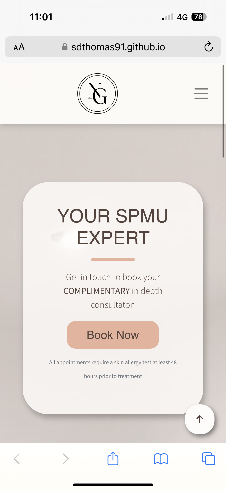 |

   - Research suggests that parallax scrolling does not always work on mobile displays and so will provide a fallback image without fixed attribute and see if it resolves issue.

   - Following testing, fallback image didn't work and caused page to load very slowly. Decided on this occasion to leave parallax effect on mobile screens as no fixed attribute has resolved the issue

   |                                               Mobile Image Resolved |
   | ------------------------------------------------------------------: |
   | 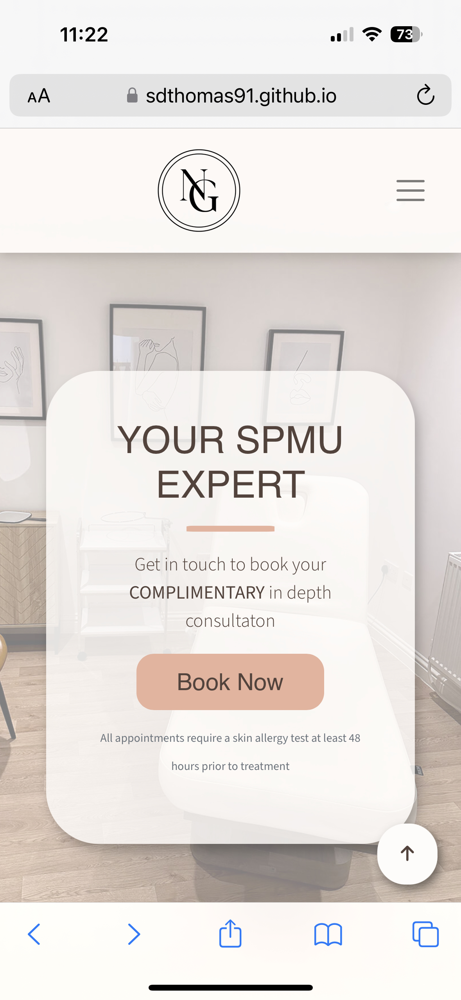 |

1. Hero image overlapping next section
   - On landscape view for some mobile devices the callout container overlaps onto the next section. The aesthetic isn't an issue, though it was causing the H1 element to get lost underneath the navbar.
   - Changed the font-size for the .lead class (the p element in the callout) to 1rem instead of 1.25 so that it can fit on a single line. This compressed the callout container slightly and allows the user to view the full callout.
   - The overlap remains, but it looks quite nice, adds flow and doesn't interfere when navigating to the section via links

## About Us Section

- ### Multi-Column (About Tech)

  - Added heading and subheading, image and paragraph. From a UX/UI perspective it didn't sit nicely on a large screen and didn't scale well across medium screens. (images below)

| Large Before                                                                 |                              Small Screen Before                              |
| ---------------------------------------------------------------------------- | :---------------------------------------------------------------------------: |
|  | 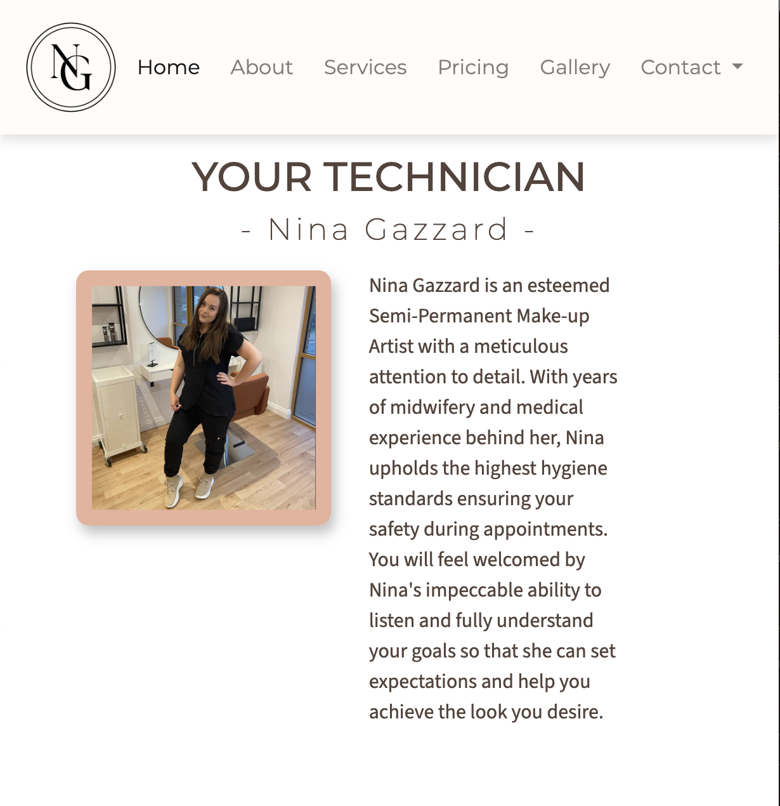 |

Amended to remove heading and include inline with image for larger screens and have content stack on smaller screens (also some styling amendements such as borders and backgrounds) - as per images below:

| Large After                                                                 |                                 Medium After                                  |
| --------------------------------------------------------------------------- | :---------------------------------------------------------------------------: |
|  |  |

## Services Section

### Service blocks

#### Desktop view

- Decided on alternating side by side display for large screens and stacked view for smaller screens
- side by side originally block colours but decided a gradient on middle element provides a more modern and elegant feel to the site
- had to ensure text and backgrounds were contrasting correctly across each block

#### Mobile view

- Originally when going for stacked decided to use a light overlay with dark text for good contrast
- Used image as background instead of stacking image and text as would be too monotonous with the element above doing the same
- Even with overlay, the blocks were not presenting nicely and were not very reader friendly
  - 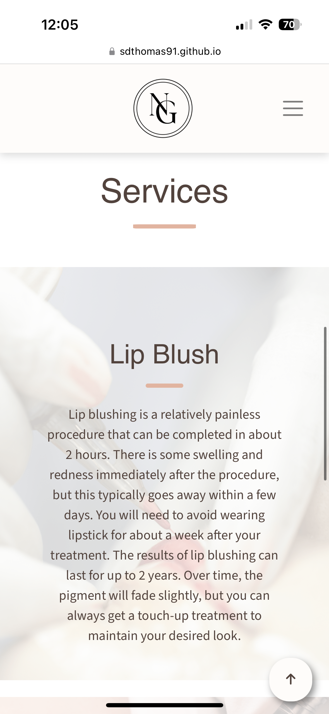
- Decided to change to a dark overlay on image block, light (but not completely opaque) container for text and uniform text and "hr" elements
  - 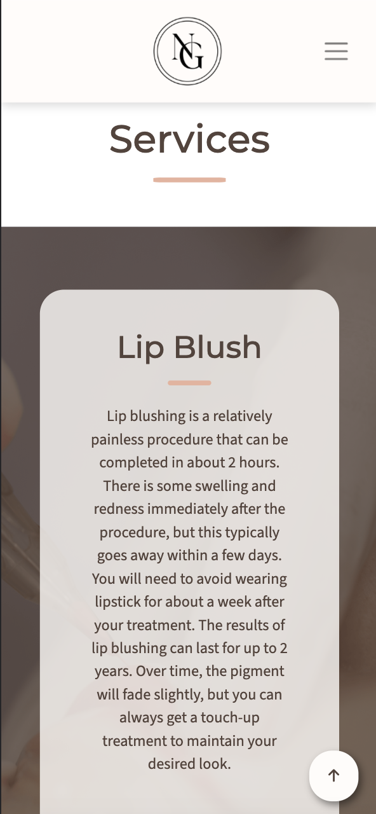
- Readability improved and screen contrast more in line with WebAIM recommendations

#### Tablet view

- Using dev tools seeing different tablet views I decided that the tablet view should replicate more the desktop thant the mobile view. Elements were too wide and the aesthetic was off. Tested separtately on iPad and displayed better - landscape view is more like destop and portrait view more like mobile.

### See Pricing Links

- Decided to add in a link to each services corresponding pricing to enhance user navigation and make it as seamless as possible.
  - Upon styling I decided I wanted to use a the brand pink as the link colour. However, this did not do well in WebAIM contrast checker
    
  - Decided to change link to brand dark colour and still use the darker pink as the hover colour to provide users with some interaction feedback.
  - Tried pink as hover color; works okay on the light blocks, however as the middle block on desktop is pink background it gets lost so interaction feedback fails. Provided additional class selector in order to provide seprate hover pseudo properties for the middle block on desktop view and now presents nicely.s

# ELEMENT TESTING

## Buttons (outside of standard buttons)

- ### Back to top button
  - Added a back to top button - had some issues with sizing and position. Used Stack Overflow article [here] (https://stackoverflow.com/questions/68627683/scroll-up-button-without-javascript#:~:text=Simply%20make%20a%20%3Ca%20href,on%20top%20of%20the%20page.&text=The%20link%20has%20the%20style,scrolls%20to%20the%20very%20top.) to help debug.
  - Added smooth scroll to CSS to ensure a smooth experience for users
  - Used empty href in order to ensure a complete top scroll - tried "ID" anchor link but was clunky and unreliable
  - Utilised interaction feedback to help users know it is a clickable button
  - Font awesome up arrow used to illustrate functionality
  - 'aria-hidden="true"' used as semantic icon - text alternative span used

## UX

### Pricing

I decided that upon reflection, for usability and in line with my user goals I would need to add a pricing section, rather than just having pricing within the services section.
This provides more clarity and information.
As there are only 3 services I have used the Bootstrap pricing template and will customise to fit with the branding and the site - as well as tweak to make it more user friendly.

1. Trialled an envato tutorial for frosted glass effect - I thought it might be a nice touch. Once implemented it didn't look as aesthetically pleasing or as readable - screenshot attached.
   

   - Didn't like the end result - Will include code in comments in original HTML for reference. Used CSS guidance but HTML was constructed largely independently with some bootstrap taken from existing structure.

1. Anchor links / tags
   - Wanted pricing to be accessible for relevant service at the click of a button. Added some basic text links that link to each service.
   - Upon testing, anchor links work well, but not on medium or larger screens - this is because they don't need their own anchor tags.
   - Tried using bootstrap display rules to present different links depending on screen size - this allowd me to link to the pricing section as whole on larger screens, and to each individual price for each individual service on smaller screens when the blocks stack.
   - Works nicely, didn't need separate links for lip pricing as when stacked, the pricing anchor link works as a nice landing point anyway.

### Benefits

For this element I wanted to provide some icons that would evoke emotion and interaction. 
-   Using font awesome and some custom css I wanted to provide a backdrop for the icon to make it more eyecatching and to tie in with the theme
    - Initially I used a solid brand #eab29d as a circular backdrop but it all looked too flat and heavy with the dark icon and the pink background
    - Added a soft box-shadow to the circle to give depth and added a gradient to the background to tie in with the rest of the site
    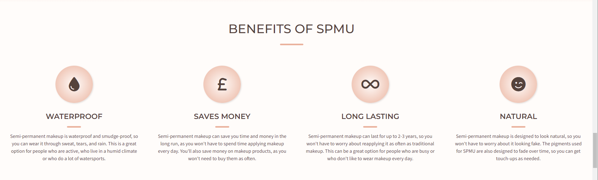
    - Used css to ensure maximum compatability, but provided a fallback colour in case the browser cannot handle gradients
    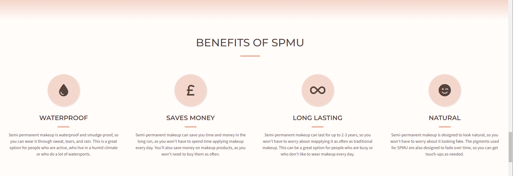
    - Did trial no background colour, and whilst I liked the effect of a raised/frosted glass coin, it didn't tie in well with the rest of the site branding and colours. It also felt a little empty and not very eye catching.
    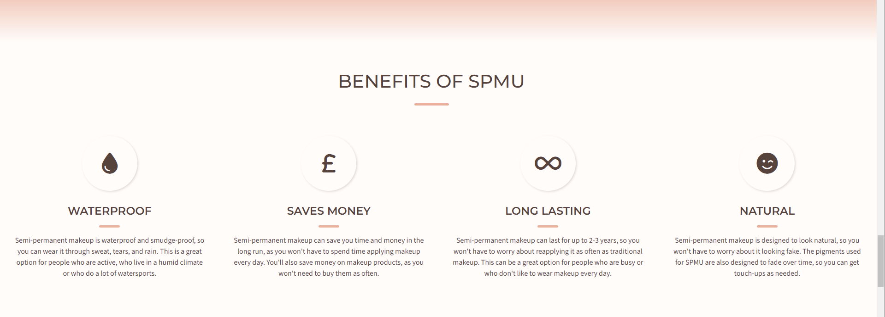